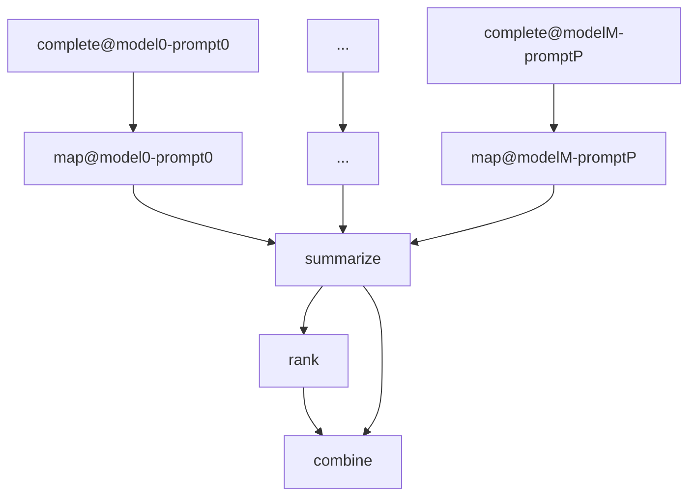
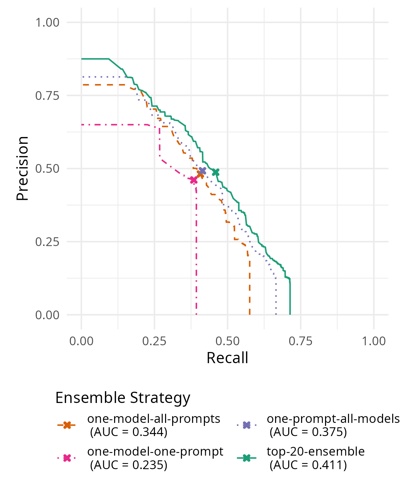

# DNB-AI-Project at SemEval-2025 Task 5: An LLM-Ensemble Approach for Automated Subject Indexing

This repository is our implementation for the SemEval-2025 Task 5 - LLMs4Subjects. Here is the webpage of the task:
https://sites.google.com/view/llms4subjects/home?authuser=0

The main idea of our system is to leverage a range of few-shot prompts and LLMs and ensemble the results, no fine-tuning required. We hande the vocabulary by mapping the LLM's keywords onto it using embeddings.
We rank fourth on the quantitative evaluation board and first on the qualitative evaluation board.

Important libraries for our system are [DVC](https://dvc.org/doc) and [vLLM](https://docs.vllm.ai/en/latest/). Our system also connects to a local [Weaviate](https://weaviate.io/) vector storage as well as a local Text Embedding Service through Huggingface TEI. You will need to set these up, before you can run the code. 
Our work results from a [project](https://www.dnb.de/EN/Professionell/ProjekteKooperationen/Projekte/KI/ki_node.html) at the German National Library (DNB), aiming at finding and testing methods for the task of subject indexing digital publications in the German language.

## Table of Contents
- [System Description](#system-description)
- [Instructions](#instructions)
- [Usage](#usage)

# System Description
## System Sketch

Please find our full system description in our submitted paper: [TBA]

The subject tagging system mainly consists of five stages:

  * `complete`: Generate free keywords with varying LLM x prompt combinations
  * `map`: Map keywords to the target vocab
  * `summarize`: Aggregate suggestions from individual model x prompt experiments to an ensemble
  * `rank`: Use an LLM to generate relevance scores for all suggestions
  * `combine`: Compute final ranking score from LLM-rating (`rank`) and ensemble vote (`summarize`)

The stages `complete` and `map` are executed for all models and prompts
specified in the params.yaml



## Results

On a dev-sample of 1000 documents that was not used in optimizing (`dev-test`)our set-up (See documents in `assets/dev-test_idns.csv`), we can report the following results:

|Ensemble Strategy     | Precision| Recall|    F1| PR-AUC|
|:---------------------|---------:|------:|-----:|------:|
|top-20-ensemble       |     0.488|  0.459| 0.420|  0.411|
|one-model-all-prompts |     0.481|  0.407| 0.393|  0.344|
|one-prompt-all-models |     0.492|  0.414| 0.407|  0.375|
|one-model-one-prompt  |     0.461|  0.385| 0.380|  0.235|

Precision, Recall and F1 are computed as document averages (macro-avg) and 
refer to the optimal calibration of the system, as marked with a 
cross on the precision-recall curves:




# Instructions

1. Clone this repository.
2. Get the data from llms4subjects: `git submodule update --init`
3. Setup local Text Embedding Service with [Huggingface TEI](https://huggingface.co/docs/text-embeddings-inference/index) and Setup a local Weaviate vector storage (see instructions with docker-compose below)
4. Install the packages from `requirements.txt` (Python 3.12.2), e.g. using `conda` or `mamba`.
  (Hint: As of 05-03-2025, you manually need to install `libsqlite==3.48.0` for DVC to work properly.)
1. Reproduce the pipeline: `dvc repro`

# Usage

## Dataset recreation
To optimize and test our system, we used two sampled splits of the dev-set of ~1000 items, `dev-opt` and `dev-test`.
This is how you can re-create them (run from ):
```bash
python src/preprocess.py -d llms4subjects/shared-task-datasets/TIBKAT/ -s dev -t Article-Book-Conference-Report-Thesis -l en de -u all-subjects-tib-core-subjects -o datasets/dev-test.csv --include_docs assets/dev-test_idns.csv 
```
```sh
python src/preprocess.py -d llms4subjects/shared-task-datasets/TIBKAT/ -s dev -t Article-Book-Conference-Report-Thesis -l en de -u all-subjects-tib-core-subjects -o datasets/dev-opt.csv --include_docs assets/dev-opt_idns.csv 
```


## Huggingface-Configuration

Some of the LLMs used in this repository have **gated access only**. You need to request access to these models
through HuggingFace and you have to provide your personal access token as an environment
variable like this before you can run our code:
```
export HF_TOKEN=hf_YOUR_PERSONAL_ACCESS_TOKEN
```

Also you may want to specify the download directory, where HuggingFace models 
are stored on your workstation, which can 
be configured in the `params.yaml` section `general.vllm_engineargs.download_dir`

In the same section `general.vllm_engineargs`, you find other settings for the
execution of vLLM. In particular, set `tensor_parallel_size` to the number
of available GPU-devices.

**Note:** Make sure you have enough GPU memory to run all the models specified
  in the `params.yaml` file. 

## Weaviate and Text embedding service

The stage that maps keyword suggestions to the target vocabulary employs
a vector search across the vocabulary. To facilitate fast HNSW-Search,
we store the vocabulary's text embeddings in a [Weaviate](https://weaviate.io/) 
vector storage, that you will need to set up locally. 
Also, this process needs to generate text embeddings. For this purpose 
we start a [HuggingFace Text-Embedding-Inference Service](https://github.com/huggingface/text-embeddings-inference) (TEI). You can launch weaviate as well as the TEI using docker compose and the provided `docker-compose.yaml` file.
Simply run `docker compose up` in this directory and your services are all
set up. 

Should you wish to change the port settings, where the two services are verved on your machine,
you will need to modify the `docker-compose.yaml` as well as the `params.yaml`.

## DVC usage

We used [DVC](https://dvc.org/doc) to synchronize the various stages of
our data processing pipeline. 
You can find installation instructions [here](https://dvc.org/doc/install).

### Most important files

Two files are crucial for using our code to perform subject tagging
* `dvc.yaml`
    * This file contains the stages, i.e. the steps to run in your experiments. For each step, you can specify which `cmd` it calls, the parameters, dependencies and output files (which can be tracked with DVC, too). Unless you want to change our procedure or change some of the hard-coded files, it doesn't need to be changed.
    * For most stages, you can find a corresponding `.py` or `.r` script that you can also run independently of the DVC pipeline.
* `params.yaml`
    * This file contains all the parameters, like prompt specifications, LLMs, prompts and more. You can adapt the parameters in this file and reproduce the pipeline (see next subsection) or change them temporarily for experiments (see subsection after next).

### Reproducing the pipeline

Using the command below, you can reproduce the entire pipeline with the parameters as specified in the `params.yaml`. Make sure to run the command in the main directory with the `dvc.yaml`.
```
dvc repro dvc.yaml
```
View the DVC's [documentation]{https://dvc.org/doc/command-reference/repro#repro} to learn about possible options for this command. 
You can also reproduce individual stages (e.g. complete) by running:
```
dvc repro -s STAGE_NAME
```

### Do your own experiments

If you want to run a multitude of experiments with different hyperparameters (and possibly queue those experiments), you could use:
```
dvc exp run
```
See the [documentation]{https://dvc.org/doc/command-reference/exp/run#exp-run} for how to run the experiments in a queue, name the experiment and modify the parameters.


## Evaluation

Metrics are computed in a seperate dvc-pipeline contained in the subfolder `eval-pipeline`. 
Currently, these are only reproducible with our internal tools, but we hope to share 
our evaluation tooling, too, asap.  